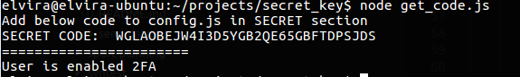
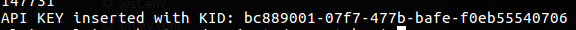
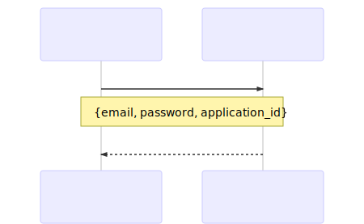
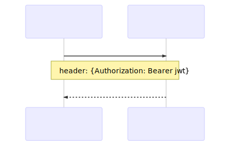
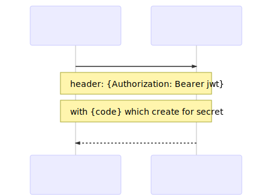
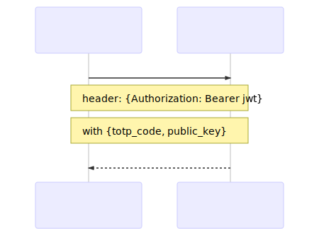
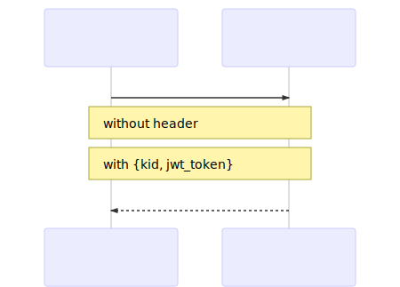

# First time (once): receive user's secret code for generate 2FA-token and turn on 2FA

## 1. Start example script `node get_code.js`

This script get JWToken by user email, password and application_id, then enable two factor authentificator and get secret for creating Google authenticator's code

## 2. Copy secret from console to `config.js` in section `SECRET`:



```javascript
    SECRET: 'WGLAOBEJW4I3D5YGB2QE65GBFTDPSJDS'
```

## For add api_key in system

1. Start example script `node add_api_key`

This script generate 2FA token (use npm-package `otpauth`)

```javascript
// prepare to generate
let totp = new OTPAuth.TOTP({
    issuer: "Barong",
    label: config.BARONG_USER.email,
    algorithm: "SHA1",
    digits: 6,
    period: 30,
    secret: OTPAuth.Secret.fromB32(config.SECRET)
});

// Generate TOTP token.
let code = totp.generate();
```
then add new api_key with [POST /api/v1/api_keys](https://github.com/rubykube/barong/blob/master/docs/index.md#postv1apikeys)

```javascript
axios({
    method: "post",
    url: config.URL_API_KEY,
    headers: {
        Authorization: `Bearer ${jwt}`
    },
    data: {
        totp_code: code,
        public_key: config.PUBLIC_KEY
    }
}).then((response)=>{
    // it is all ok
}).catch((err)=>{
    // error while post
})
```

from terminal copy KID and paste it to `KID` section in `config.js`



## Get JWT using private key and api_key id (kid)

1. Start example script `node index.js`

This script create own JWT (signed by own private key) and send it to Barong [POST /api/v1/sessions/generate_jwt](https://github.com/rubykube/barong/blob/master/docs/index.md#postv1sessionsgeneratejwt) for receiving peatio jwt to access to peatio api.


# DFD

### Get jwt by email, password, application id



### Get qr code for generating google authenticator's code



### Enable 2FA for user



### Add api_key



### Get JWT using safe-signed token

